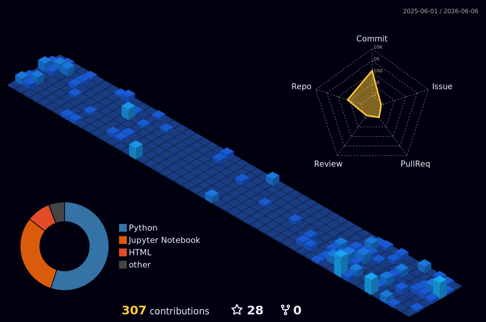

<h1 align="center">Hi 👋, I'm Enzo Mediano</h1>
<h3 align="center">Software Engineering Student @ PUC-Rio</h3>

 
   

---

---

### 👨🏻‍💻 About Me

- 🌱 Currently exploring the intersections of **Generative AI, Cloud Architecture, and Full-Stack Development**.
- 💬 Always open to discussing **Databases, System Design, and Software Engineering**.
- 🌎 Nationality: American/Brasilian 🇺🇸 🇧🇷
- 📫 Reach out at: **[enzotresmediano@gmail.com](mailto:enzotresmediano@gmail.com)**

  
  
  
  

---

### 🛠️ Languages & Tools

**Languages**
 

**Frameworks**
 

**Agents & AI**
 

**Cloud & DevOps**
 

**Databases**
 

**Tools**
 

---

### 🏙️ Contribution Cityscape

  

